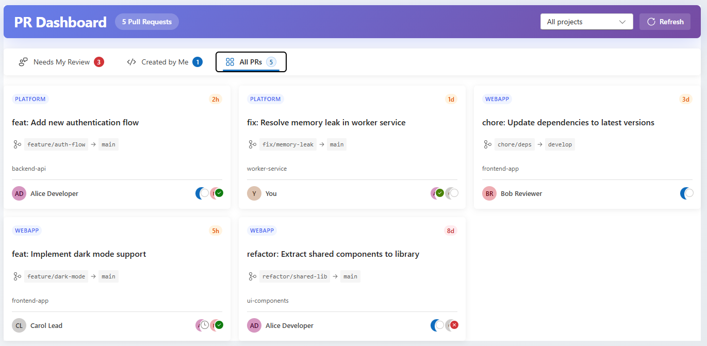

# Pull Request Dashboard

A modern, cross-project pull request dashboard for Azure DevOps that gives you a unified view of all your pull requests across multiple projects and repositories.

## Features

- **Cross-project overview** - See pull requests from all your projects in one place
- **Smart filtering** - Filter by project, or view all projects at once
- **Three convenient views**:
  - **Needs My Review** - PRs waiting for your review
  - **Created by Me** - Your own pull requests
  - **All PRs** - Complete overview of all active PRs
- **Real-time status** - See reviewer votes and approval status at a glance
- **Quick navigation** - Click any PR to open it directly in Azure DevOps
- **Progressive loading** - PRs appear as they load for faster initial display

## Screenshots

## Getting Started

1. Install the extension from the Azure DevOps Marketplace
2. Navigate to **Azure Repos** in your project
3. Click on **Pull Request Dashboard** in the hub menu
4. Select a project from the dropdown or choose "All projects"

## Privacy

This extension only accesses data within your Azure DevOps organization. No data is sent to external servers.

## Feedback & Support

Found a bug or have a feature request? Please report issues at our GitHub repository:

[https://github.com/jpbroeders/azure-devops-pull-request-dashboard](https://github.com/jpbroeders/azure-devops-pull-request-dashboard)

## About

This extension is developed by FreelyIT.

- Website: [https://www.freelyit.nl](https://www.freelyit.nl)
- Developer: [https://www.jeanpierrebroeders.nl](https://www.jeanpierrebroeders.nl)

## Version History

- **1.1.3** - Initial version
